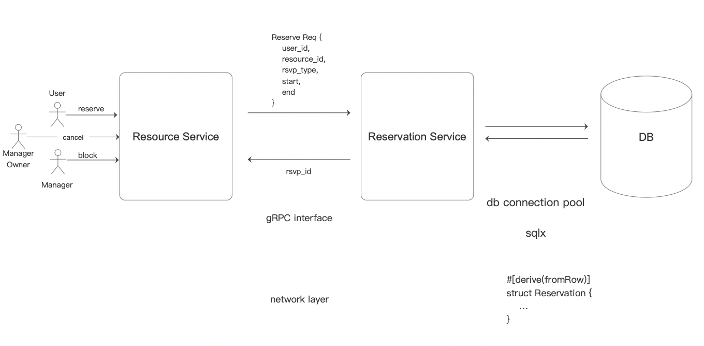

# Resource Reservation

- Feature Name: resource-reservation
- Start Date: 2025-09-25 22:24

# Summary

A reservation system simplifies resource management by preventing conflicts, boosting efficiency, and enhancing the user experience with transparent, automated bookings. We will use Postgres constraints to ensure that only one reservation can be made for a specific resource at any given time.

# Motivation

We need a common solution for various reservation requirements, including: (1) calendar booking; (2) hotel booking; (3) meeting room booking; (4) parking lot booking; (5) etc. Repeatedly developing features for these requirements is a wast of time and resources. We should have a common solution that can be used by all times.

# Guide-level explanation

## Service Interface

Basic Architecture


We use gRPC as the service interface. Below is the proto definition:

```proto
enum ReservationUpdateType {
    UNKNOWN = 0,
    CREATE = 1,
    UPDATE = 2,
    DELETE = 3,
}

enum ReservationStatus {
    UNKNOWN
    PENDING,
    CONFIRMED,
    BLOCKED
}

message Reservation {
    id: String,
    user_id: String,
    status: ReservationStatus,

    // resource reservation window
    resource_id: String,
    start: Date,
    end: Date,


    // extra window
    note: String,
}
// reserve request
message ReservationRequest {
    reservation: Reservation,
}
message ReservationResponse {
    reservation: Reservation,
}
// update reservation
message UpdateRequest {
    resource_id: String,
    start: Date,
    end: Date,
    note: String,
}
message UpdateResponse {
    reservation: Reservation
}
// confirm reservation
message ConfirmRequest {
    resource_id: String,
}
message ConfirmResponse {
    reservation: Reservation
}
// cancel reservation
message CancelRequest {
    resource_id: String,
}
message CancelResponse {
    reservation: Reservation
}

// query reservation
message QueryRequest {
    user_id: String,
    reservationStatus: ReservationStatus,
    resource_id: String,
    start: Date,
    end: Date,
}

message listenRequest {}

service ReservationService {
    rpc reserve(ReservationRequest) returns (Reservation),
    rpc update(UpdateRequest) returns (UpdateResponse),
    rpc confirm(ConfirmRequest) returns (ConfirmResponse)
    rpc cancel(CancelRequest) returns (CancelResponse),
    rpc get(Reservation) returns (Reservation),
    rpc query(QueryRequest) returns (stream Reservation),

    // another system can monitor newly added/confirmed/canceled reservations
    rpc listen(listenRequest) returns (stream Reservation)
}
```

# Database Schema

We will use postgres as the database. Below is the schema:

```sql
create schema rsvp;

CREATE TYPE revp.reservation_update_type as ENUM (
    'unknown', 'create', 'update', 'delete'
);
create type rsvp.reservation_status AS ENUM (
    'unknown', 'pending', 'confirmed', 'blocked'
);

create table rsvp.reservations (
    id uuid NOT NULL DEFAULT uuid_generate_v4(),
    user_id varchar(64) NOT NULL,
    status reservation_status NOT NULL DEFAULT 'pending',
    resource_id varchat(64) NOT NULL,
    timespan tsrange NOT NULL,
    note text,

    CONSTRAINT reservations_pkey PRIMARY KEY(id),
    CONSTRAINT reservations_conflict EXCLUDE USING gist (resource_id WITH =, timespan WITH &&)
);

CREATE TABLE rsvp.reservation_changes (
    id SERIAL NOT NULL,
    reservation_id uuid NOT NULL,
    op rsvp.reservation_update_type NOT NULL,
);

create index reservation_resource_id_idx ON rsvp.reservations(resource_id);
create index reservation_user_id_idx ON rsvp.reservations(user_id);

-- trigger for add/update/cancel a reservation
create or replace FUNCTION rsvp.reservations_trigger() RETURNS TRIGGER AS
$$
    BEGIN
        IF TG_OP = 'INSERT' THEN
            INSERT INTO rsvp.reservation_changes (reservation_id, op) values (NEW.id, 'create');

        ELSIF TG_OP = 'UPDATE' THEN
            -- only if status changed, then insert a record.
            IF OLD.status <> NEW.status
                INSERT INTO rsvp.reservation_changes (reservation_id, op) values (NEW.id, 'update');
            END IF;

        ELSIF TG_OP = 'DELETE' THEN
            INSERT INTO rsvp.reservation_changes (reservation_id, op) values (NEW.id, 'delete');

        END IF;

        NOTIFY reservation_update;

        RETURN NULL;
    END
$$
LANGUAGE plpgsql;

CREATE TRIGGER reservations_trigger
    ALTER INSERT OR UPDATE OR DELETE ON rsvp.reservations
    FOR EACH ROW EXECUTE PROCEDURE rsvp.reservations_trigger();
```

Explain the proposal as if it was already included in the language and you were teaching it to another Rust programmer. That generally means:

- Introducing new named concepts.
- Explaining the feature largely in terms of examples.
- Explaining how Rust programmers should _think_ about the feature, and how it should impact the way they use Rust. It should explain the impact as concretely as possible.
- If applicable, provide sample error messages, deprecation warnings, or migration guidance.
- If applicable, describe the differences between teaching this to existing Rust programmers and new Rust programmers.
- Discuss how this impacts the ability to read, understand, and maintain Rust code. Code is read and modified far more often than written; will the proposed feature make code easier to maintain?

For implementation-oriented RFCs (e.g. for compiler internals), this section should focus on how compiler contributors should think about the change, and give examples of its concrete impact. For policy RFCs, this section should provide an example-driven introduction to the policy, and explain its impact in concrete terms.

# Reference-level explanation

[reference-level-explanation]: #reference-level-explanation

This is the technical portion of the RFC. Explain the design in sufficient detail that:

- Its interaction with other features is clear.
- It is reasonably clear how the feature would be implemented.
- Corner cases are dissected by example.

The section should return to the examples given in the previous section, and explain more fully how the detailed proposal makes those examples work.

# Drawbacks

[drawbacks]: #drawbacks

Why should we _not_ do this?

# Rationale and alternatives

[rationale-and-alternatives]: #rationale-and-alternatives

- Why is this design the best in the space of possible designs?
- What other designs have been considered and what is the rationale for not choosing them?
- What is the impact of not doing this?
- If this is a language proposal, could this be done in a library or macro instead? Does the proposed change make Rust code easier or harder to read, understand, and maintain?

# Prior art

[prior-art]: #prior-art

Discuss prior art, both the good and the bad, in relation to this proposal.
A few examples of what this can include are:

- For language, library, cargo, tools, and compiler proposals: Does this feature exist in other programming languages and what experience have their community had?
- For community proposals: Is this done by some other community and what were their experiences with it?
- For other teams: What lessons can we learn from what other communities have done here?
- Papers: Are there any published papers or great posts that discuss this? If you have some relevant papers to refer to, this can serve as a more detailed theoretical background.

This section is intended to encourage you as an author to think about the lessons from other languages, provide readers of your RFC with a fuller picture.
If there is no prior art, that is fine - your ideas are interesting to us whether they are brand new or if it is an adaptation from other languages.

Note that while precedent set by other languages is some motivation, it does not on its own motivate an RFC.
Please also take into consideration that rust sometimes intentionally diverges from common language features.

# Unresolved questions

[unresolved-questions]: #unresolved-questions

- What parts of the design do you expect to resolve through the RFC process before this gets merged?
- What parts of the design do you expect to resolve through the implementation of this feature before stabilization?
- What related issues do you consider out of scope for this RFC that could be addressed in the future independently of the solution that comes out of this RFC?

# Future possibilities

[future-possibilities]: #future-possibilities

Think about what the natural extension and evolution of your proposal would
be and how it would affect the language and project as a whole in a holistic
way. Try to use this section as a tool to more fully consider all possible
interactions with the project and language in your proposal.
Also consider how this all fits into the roadmap for the project
and of the relevant sub-team.

This is also a good place to "dump ideas", if they are out of scope for the
RFC you are writing but otherwise related.

If you have tried and cannot think of any future possibilities,
you may simply state that you cannot think of anything.

Note that having something written down in the future-possibilities section
is not a reason to accept the current or a future RFC; such notes should be
in the section on motivation or rationale in this or subsequent RFCs.
The section merely provides additional information.
